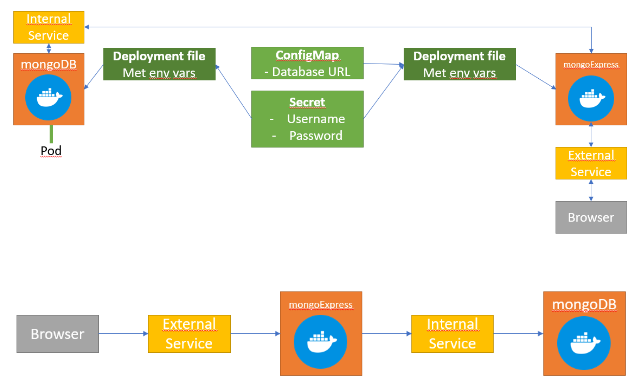

# Kubernetes Config Files - Oefeningen

Bouw de volgende situatie:
* Via config-files en gebruik van "kubectl apply -f" configuratie aanmaken en uitvoeren. 
* Maak een nieuwe folder aan waar al deze YAML-bestanden worden opgeslagen.
* Doel:
    * mongoDB database hosten en beheren met behulp van mongoExpress (een beheertool voor mongo geschreven in node, vergelijkbaar met phpMyAdmin).
    
    * Maak gebruik van:
        * 2 deployments/pods
        * 2 services
        * 1 ConfigMap
        * 1 Secret

    * De bedoeling is dat mongodb niet bereikbaar is van buitenaf, maar enkel binnenin de cluster, dit doen we door een internal service aan die deployment te koppelen. 
    * mongoExpress moet wel bereikbaar zijn via poort 30000, dus we gebruiken daar een external service. 
    

---

> Kijk na dat enkel de k8s service aan het draaien is:

    ````
    kubectl get all
    ````

--- 

## Stap 1: mongodb deployment
Maak een nieuwe file aan om de mongo (Links to an external site.) deployment in te configureren, baseer je op de nginx deployment die je vorige keer als voorbeeld heb gekregen. Je hebt maar 1 replica nodig voor je mongodb. Let er zeker op dat je een duidelijke naam en labels mee geeft aan je deployment.

Zoek via Docker Hub op wat de default port voor mongodb is en voeg deze toe als containerPort in de specs van je template.

Kijk ook na wat de opties zijn voor enviornment variables voor mongo, aangezien we deze willen meegeven aan de hand van een config-file en niet zomaar willen hardcoden of blanco laten.

Als we enviornment variabelen willen meegeven aan een image kan dat door de volgende code toe te voegen aan de configfile:

env:
- name: MONGO_INITDB_ROOT_USERNAME
  value: 
- name: MONGO_INITDB_ROOT_PASSWORD
  value: 
Momenteel laten we de values nog even blanco.

## Stap 2: Secret aanmaken
We kunnen veronderstellen dat bovenstaande configuratiefile mee op een git repo zou kunnen gepushed worden en wachtwoorden in plaintext op internet zetten is iets dat we absoluut willen vermijden. Om dit op te lossen gaan we gebruik maken van de Secret component van k8s en vervolgens naar deze Secret verwijzen in onze configfile van de deployment.

Om een Secret aan te maken maken we een nieuwe configfile aan en plakken we er de volgende gegevens in:

````
apiVersion: v1
kind: Secret
metadata:
    name: naam-van-je-secret # bvb mongodb-secret, je zal naar deze naam verwijzen op andere plaatsen
type: Opaque # eventueel kan je hier bvb ook verwijzen naar certificates, opaque is een simple key-value oplossing
data:
    naam-van-key: <string in base64> # je kan ook hier zelf de namen kiezen
    naam-van-key-2: <string in base64> # de verwachte string is een string encoded in base64
````

Een gemakkelijke manier om de base64 van een string te krijgen is met volgend terminal commando: "echo -n 'mijnstring' | base64".

Van zodra we deze file hebben aangemaakt en gesaved moeten we deze ook effectief gaan toepassen op de cluster. Ook hier kunnen we het kubectl apply command voor gebruiken. Je kan met "kubectl get secret" controleren of deze correct is aangemaakt.

Let op: Je gaat in andere configuratiefiles verwijzen naar de data uit je Secret, dus is het belangrijk dat je je Secret eerst gaat beschikbaar maken in de cluster alvorens andere configs die hiervan gebruik maken te apply'en.

Je kan nu de value van je enviornment vars gaan updaten als volgt:

````
env:
- name: MONGO_INITDB_ROOT_USERNAME
  valueFrom:
    secretKeyRef:
      name: de-naam-van-je-secret
      key: naam-van-key

````

Apply je deployment van zodra je deze gegevens hebt geupdate. Controleer of je pod aangemaakt en draaiende is.

----


## Stap 3: internal Service aanmaken
Nu onze deployment is aangemaakt moeten we een Service aanmaken zodat we intern ook effectief met onze database gaan kunnen communiceren. We kunnen een nieuwe file aanmaken om de config van onze service te saven, maar we kunnen in YAML ook eventueel 2 documenten in dezelfde file bewaren, dat doen we door 3 koppeltekens "---" toe te voegen onder de laatste lijn van de config voor onze deployment en daarna onze deze dashes de config van onze service te schrijven.

> Voor de internal Service aan te maken kunnen we onderstaande config gebruiken:

````
apiVersion: v1
kind: Service
metadata:
  name: naam-van-service # kies hier iets logisch
spec:
  selector:
    app: naam-van-de-pods # zal moeten overeen komen met de naam die je bij de deployment hebt gekozen om deze aan elkaar te linken
  ports:
  - protocol: TCP
    port: 12345 # de Service port
    targetPort: 12345 # moet overeen stemmen met containerPort van de Deployment
````

Apply deze Service en controleer of deze is aangemaakt.

---

## Stap 4: mongoExpress deployment aanmaken
Maak een basis deployment aan voor mongoExpress (Links to an external site.).

Naast de standaard zullen we hier ook weer nood hebben aan de containerPort en 3 enviornmental variabelen, de username, password en database host. De keys voor deze variabelen zijn te vinden op de Docker Hub pagina van mongoExpress. Denk eraan dat we reeds een Secret hebben met de username en password, we kunnen deze dus hergebruiken en zullen deze maar op één plaats moeten aanpassen als we ooit deze gegevens willen wijzigen.

Voor onze host gaan we gebruiken maken van een ConfigMap, dus we laten die value nog even blanco.


---

## Stap 5: ConfigMap aanmaken
Quasi analoog met Secret: 

apiVersion: v1
kind: ConfigMap
metadata:
  name: naam-van-je-cm
data:
  naam-van-key: value
Specifiek voor onze case waar we de url van onze database willen meegeven kunnen we of het IP-adres hardcoden, of de naam van onze service meegeven. Bewaar je file en apply op je cluster. Net zoals bij de Secret is de volgorde van bewerkingen belangrijk.

Verwijzen naar de value uit een ConfigMap is exact hetzelfde als verwijzen naar een Secret, alleen vervangen we secretKeyRef door configMapKeyRef. Voeg dit ook toe aan de config van je mongo-express en apply de deployment.

---

## Stap 6: External Service aanmaken
Tot slot zullen we ervoor moeten zorgen dat we onze mongoExpress ook effectief kunnen bekijken in een browser. Dit doen we door een External Service aan te maken voor onze deployment. Net zoals de vorige keer kunnen we ervoor kiezen om de config van de service in een nieuwe file te bewaren, of --- toe te voegen in onze deployment file en het eronder te schrijven.

We starten met dezelfde code als dat we hebben gebruikt voor onze internal service. Om er een external service van te maken zullen we twee dingen moeten aanpassen:

We moeten in de spec de optie type toevoegen en deze gelijk stellen aan 'LoadBalancer'
We moeten bij onze poortconfiguratie naast een port en targetPort ook een nodePort toevoegen, wat de eigenlijke poort zal zijn dat we via onze browser moeten bezoeken. In dit geval wensen we dat dit poort 30000 is
Apply alle wijzigingen en controleer via 'kubectl get service' of je nieuwe service is aangemaakt, het type LoadBalancer heeft en naar het juiste poortnummer aan het luisteren is (bij minikube zal je external-ip op <pending> blijven staan).

Om via minikube toch een IP toe te kennen aan de service en deze te launchen kan je het volgende commando uitvoeren: minikube service naam-van-service 

Als alles goed is gegaan zal je de startpagina van mongoExpress zien en kan je zo je mongodb gaan beheren.

 
---
## MongoExpress

Probeer zelf te kijken hoeveel dingen je gemakkelijk kan aanpassen, bijvoorbeeld namen of de username en password van je mongo install, en kijk hoe moeilijk het is om deze veranderingen effectief door te voeren op een manier dat alles blijft werken.